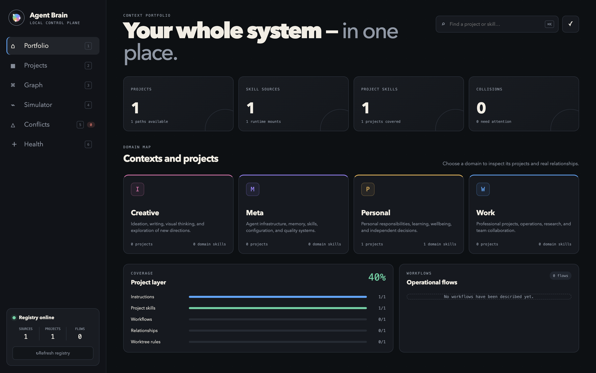

# Agent Brain

Agent Brain is a local-first control plane for AI-agent instructions, skills,
projects, worktrees, and life/work contexts. It gives Codex, Claude, and other
agent runtimes one deterministic answer to: **which rules and capabilities
belong in this folder?**



## Key capabilities

- **Interactive knowledge graph** — pan, zoom, and drag nodes freely on the
  canvas; connect projects by dragging from node ports with a live edge
  preview; click any edge to inspect or delete the relationship.
- **Node inspector** — click any domain, project, workflow, or skill node to
  see its details and act on it (edit, delete, change scope) without leaving
  the graph.
- **Context resolver** — simulate any folder and see exactly which domain,
  project, workspace, skills, and workflows an agent will receive there.
- **Folder inspector** — pick an application folder and see its whole agent
  harness: skills, rules, instruction files, agents, hooks, and MCP servers,
  each with where it is installed and what it is for. Switch skills and rules
  on or off per folder, and get deterministic recommendations of what is worth
  enabling based on the code in that folder (`brain inspect`,
  `brain recommend`, `brain skill on|off`, `brain rule on|off`).
- **Collision radar and health checks** — find same-name skills and broken
  references before they surprise an agent mid-task.
- **Onboarding skill** — `skills/brain-onboarding` lets your agent populate a
  fresh registry from your real projects: discover, propose a plan, register
  after your approval, then verify with a walk test.
- **Relations map** — `brain build` generates a Markdown map of domains,
  project relations, and workflows at `~/.agent-brain/reports/relations.md`.
- **Local-first** — plain JSON and Markdown registry in `~/.agent-brain`;
  nothing leaves your machine.

## Why

Agent runtimes can mount many skills globally even when those skills belong to
one project or one area of life. That creates accidental conflicts. Agent Brain
models physical installation separately from logical ownership and gives the
runtime explicit routing guidance:

- `global` — safe across unrelated tasks;
- `domain` — work, personal, creative, or any domain you define;
- `project` — owned by one repository or product;
- `plugin` — supplied by an installed plugin and activated explicitly;
- `archive` — visible for diagnostics, never selected automatically.

The same registry powers the CLI, runtime hooks, validation, visual graph, and
the sandboxed Electron application.

## Install on macOS

Download the universal DMG from [GitHub Releases](https://github.com/InfinityScripter/agent-brain/releases).
It runs on both Apple Silicon and Intel Macs.

The DMG includes its own pinned Python runtime for both architectures. The
current community build is ad-hoc signed but not Apple-notarized. On first launch, Control-click Agent
Brain in Finder, choose **Open**, then confirm **Open**. This uses macOS's normal
per-app approval flow; do not disable Gatekeeper or remove quarantine globally.

On first launch the app creates a private registry at `~/.agent-brain` and
discovers skills from the standard shared, Codex, and Claude locations. The
desktop app and CLI do not upload registry data: paths, manifests, and generated
inventory remain on your machine. Opt-in hooks add the runtime, active domain,
project/workspace identifiers, resolution source and scope chain, up to five
active collision names, and registered workflow IDs to the prompt context
processed by that runtime; they do not include filesystem or registry paths.

The starter registry intentionally contains domains but no invented projects.
Open **Projects → Add project** to register each work or personal folder; its
local `AGENTS.md`, `CLAUDE.md`, and project skill roots are then linked into the
same graph without copying their contents.

To let an agent do that mapping for you, install
[`skills/brain-onboarding`](skills/brain-onboarding/SKILL.md) into your agent
runtime (for Claude Code: copy or symlink the folder into `~/.claude/skills/`)
and ask it to "map my projects". The skill discovers projects on disk, shows a
plan for your approval, registers everything through the `brain` CLI, and
finishes with a walk test plus the generated relations map.

## Run from source

Requirements: macOS 12+, Python 3.9+, Node.js 20+. The DMG bundles Python and
does not require a separate Python installation.

One command from clone to a running app:

```bash
git clone https://github.com/InfinityScripter/agent-brain.git && cd agent-brain && npm ci && npm start
```

`npm start` initializes the private registry on first launch. To prepare the
registry from the terminal instead, run `./bin/brain init` before `npm start`.

Register a project:

```bash
./bin/brain project add ~/Projects/my-app \
  --domain personal.software \
  --description "My application"
```

Agent Brain detects `AGENTS.md`, `CLAUDE.md`, and project-local skill roots.
The desktop app can then edit or remove the registry entry, move it between
domains, manage typed project relationships and worktree rules, and preserve
the external project folder. Portfolio editors create domains and ordered
workflows; the graph supports drag-and-drop project links and moves plus a
keyboard-accessible form alternative. Skill Inspector can assign global,
domain, project, plugin, archive, or automatic source-based ownership.

## CLI

```bash
./bin/brain init
./bin/brain build
./bin/brain status --cwd /path/to/project
./bin/brain inspect --cwd /path/to/project
./bin/brain recommend --cwd /path/to/project
./bin/brain skill off <listed-name> --cwd /path/to/project
./bin/brain rule off <rule-name> --cwd /path/to/project
./bin/brain explain <skill-name-or-id> --cwd /path/to/project
./bin/brain validate
./bin/brain use personal
./bin/brain use auto
./bin/brain serve
./bin/brain project update my-app --domain work
./bin/brain project dependencies my-app --json
./bin/brain project delete my-app --cascade
./bin/brain workflow save release --name "Release" --domain work --steps-json '["global.review"]'
./bin/brain domain save research --name "Research"
./bin/brain skill scope project.my-app.review --level domain --domain work
```

Use a custom registry directory with either:

```bash
./bin/brain --registry /path/to/registry status
AGENT_BRAIN_HOME=/path/to/registry npm start
```

## Registry model

The private registry is plain JSON and Markdown:

```text
~/.agent-brain/
├── config/brain.json
├── domains/**/domain.json
├── projects/*.json
├── workflows/**/*.json
├── data/inventory.json       # generated
├── reports/audit.md          # generated
├── reports/relations.md      # generated relations map
├── state/                    # local override
└── views/                    # generated dashboard/canvas
```

Starter domains are Work, Personal, Personal Software, Creative, Meta, and
Meta Agent System. They are examples, not hard-coded product behavior: rename,
remove, nest, or extend them freely.

Scope and source precedence can be declared without changing Python:

```json
{
  "skill_scope_rules": [
    {
      "source_pattern": "/company-tools/",
      "level": "domain",
      "domain": "work.company"
    }
  ],
  "source_priority_rules": [
    {
      "source_pattern": "/canonical-skills/",
      "priority": 190,
      "role": "company canonical"
    }
  ]
}
```

Plugin skills remain inactive by default. Add a plugin ID to
`config/brain.json` only when it should participate automatically:

```json
{ "active_plugins": ["my-plugin"] }
```

## Runtime integration

The registry works without changing agent configuration. For automatic prompt
context, see [adapters/README.md](adapters/README.md). The adapters are opt-in
and preserve existing hooks. Agent Brain is a routing control plane: the hook
adds deterministic context but cannot remove capabilities that a host runtime
has already exposed globally. Use host-level plugin/skill settings as the hard
capability boundary.

## Desktop security

The Electron renderer has no Node.js access. It uses context isolation, the
Chromium sandbox, a narrow preload bridge, sender-validated IPC, denied
navigation/windows/permissions, a restrictive CSP, hardened Electron fuses,
bounded Python subprocess output, timeouts, atomic writes, and serialized
registry mutations.

The packaged application contains only the engine and starter templates. It
never embeds the developer's private registry, projects, generated inventory,
or skill contents.

## Development

```bash
python3 -m unittest discover -s tests -v
npm test
npm run test:visual
./bin/brain validate
npm run package:universal
npm run test:package
npm run make:universal
```

See [CONTRIBUTING.md](CONTRIBUTING.md) for the release and privacy gates.

## License

[MIT](LICENSE)
